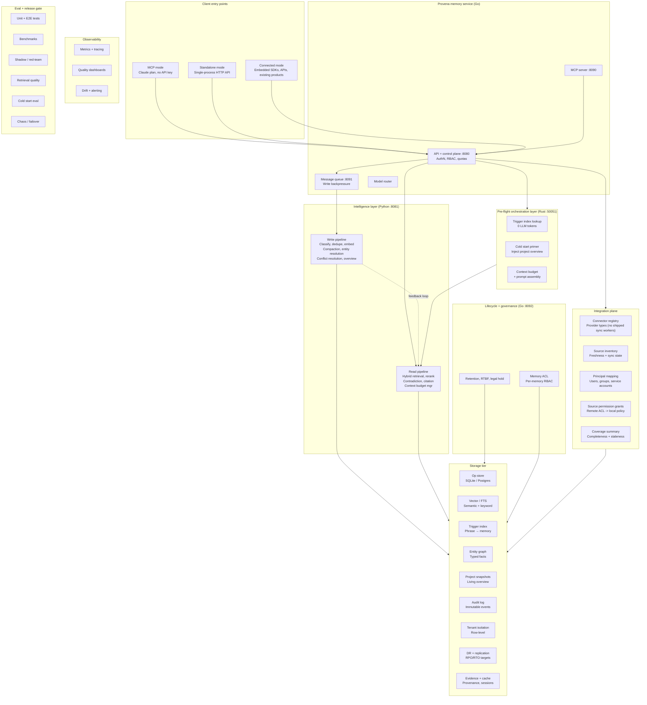
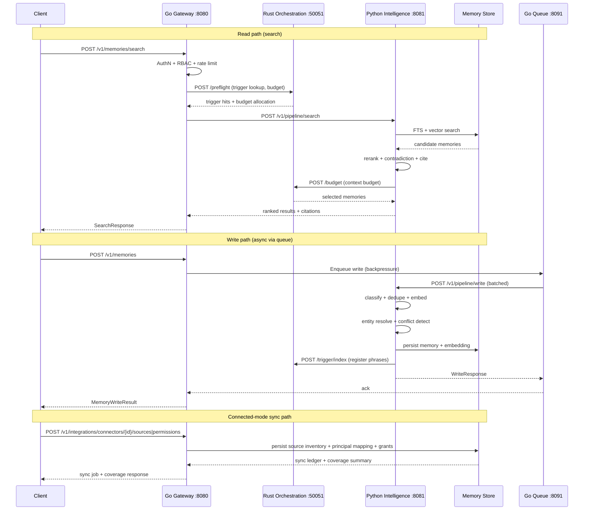

# Provena Architecture

Provena is a polyglot, provenance-first memory service for LLM applications.
It splits into three language layers — each chosen for where it excels —
connected by HTTP interfaces today; protobuf/gRPC migration remains roadmap.

The installable repository-memory path is intentionally smaller: the Node CLI
creates a Git-tracked brain, event ledger, deterministic graph, context packets,
agent/MCP integrations, and an optional Neo4j projection without requiring any
of the services below. See
[Repo Memory Architecture](./docs/REPO_MEMORY_ARCHITECTURE.md). The polyglot
topology becomes an optional shared/enterprise projection rather than a
prerequisite for `provena init`. The portable path uses stdio MCP and opens no
HTTP port.

## Language boundary pattern

| Layer | Language | Owns | Why |
|---|---|---|---|
| **Hot path** | Rust | Orchestration, trigger index, context budget, token counter, prompt assembly | Sub-ms latency, zero GC, CPU-bound |
| **Infrastructure** | Go | API gateway, MCP server, queue consumer, lifecycle, observability | Concurrency, I/O-bound, single binary |
| **Intelligence** | Python | Write pipeline, read pipeline, model router, embeddings, eval | ML ecosystem, LLM SDKs, rapid iteration |

## System diagram

The diagram below represents the full polyglot deployment. The current
single-process standalone entrypoint is called out separately under
[Service topology](#service-topology).

## Request flow

## Service topology

| Service | Language | Port | Responsibility |
|---|---|---|---|
| `orchestration` | Rust | 50051 | Trigger index, context budget, token counter, prompt assembly, cold start |
| `gateway` | Go | 8080 | API + control plane (AuthN, RBAC, quotas, routing) |
| `mcp` | Go | 8090 | MCP protocol server for Claude/LLM clients |
| `queue` | Go | 8091 | Message queue consumer with backpressure |
| `lifecycle` | Go | 8092 | Retention policies, legal hold, RTBF |
| `intelligence` | Python | 8081 | Write pipeline, read pipeline, model router, embeddings, overview |
| `store` | Python | 8000 | Core memory CRUD, FTS, relations, audit log |

Current shipped deployment shapes:

- Standalone runs the Python store app directly, and clients call it on `:8000`
  by default.
- Polyglot exposes the Go gateway on `:8080` and keeps `store`,
  `orchestration`, `intelligence`, `queue`, `lifecycle`, and `mcp` behind it.
- Connected mode currently lands through those gateway and store APIs rather
  than a separate connector daemon.

The integration-plane APIs own connector registry,
source inventory, principal mapping, source permission grants, sync jobs, and
tenant-level coverage summaries. Ingestion today is push-based: an external
caller writes sources, principal mappings, permission grants, and sync-job
ledger entries through those APIs. There are no first-party scheduled sync
workers yet, so the connector registry stores provider *types* only and does
not imply Provena can crawl those systems.

`scripts/run_scheduler_tick.py` provides an optional fixed-cadence tick against
the store. It reads per-connector `metadata.scheduler` settings and dispatches
through the shared connector execution contract, but it only acts on providers
that have a registered real worker. The tick raises `KeyError` for an
unregistered provider and records the connector as skipped with reason
`provider_not_implemented` (writing nothing). The bundled CLI registers no
workers, so it is a no-op against the ledger today.

## Storage tier

| Store | Technology | Purpose |
|---|---|---|
| Op store | SQLite / PostgreSQL | Core memory records |
| Vector / FTS | SQLite FTS5 + sqlite-vec when available; PostgreSQL `tsvector` | Keyword search plus KNN or linear cosine fallback; PostgreSQL pgvector KNN is roadmap |
| Trigger index | In-memory (Rust DashMap) | Sub-ms phrase → memory lookup |
| Entity graph | Relations table | Typed links between memories |
| Repo graph | Deterministic JSON / optional Neo4j | Current files, symbols, packages, commands, environment variables, imports/uses, and graph analytics; temporal history is roadmap |
| Project snapshots | Snapshot table | Living project overview |
| Audit log | Append-only table | Immutable lifecycle events |
| Tenant isolation | Row-level filtering | Schema/row-level isolation |
| DR + replication | Replication state table | RPO/RTO tracking |
| Evidence + cache | Cache table | Session provenance, cached retrievals |
| Connector registry | Connector tables | External system definitions and sync policy |
| Source inventory | Source tables | Source freshness, status, and metadata |
| Principal mapping | Mapping tables | Local principal to remote identity resolution |
| Source grants | Grant tables | Permission-preserving recall foundations |
| Sync jobs | Job ledger | Connector freshness and operational coverage |

## Connected mode and integration plane

Connected mode is the path that lets Provena plug into an existing product or
enterprise environment instead of asking teams to replace their current stack.
It adds five foundations:

1. Connector registry for system-level integrations.
2. Source inventory for every synced document, channel, ticket, or record.
3. Principal mapping from local users/groups to remote identities.
4. Source permission grants so retrieval inherits external ACLs.
5. Coverage summaries so operators can see completeness, staleness, and sync health.

Current admin API coverage:

- `POST /v1/integrations/connectors`
- `GET /v1/integrations/connectors`
- `POST /v1/integrations/connectors/{connector_id}/sources/batch`
- `POST /v1/integrations/connectors/{connector_id}/principal-mappings/batch`
- `POST /v1/integrations/connectors/{connector_id}/permissions/batch`
- `POST /v1/integrations/connectors/{connector_id}/sync-jobs`
- `GET /v1/integrations/coverage`

Scheduled sync creation complements those routes. Operators opt a connector
into cadence-driven job creation with `metadata.scheduler.enabled=true` plus a
fixed `cadence_seconds` value, then run the internal scheduler tick on the same
store boundary in standalone or polyglot deployments.

## Interfaces between layers

- **Go → Rust**: HTTP POST to orchestration service (`:50051`)
- **Go → Python**: HTTP POST to intelligence service (`:8081`)
- **Python → Rust**: HTTP POST for trigger index + budget operations
- **Python → Store**: HTTP POST to existing memory store (`:8000`)
- Future: migrate to gRPC with protobuf contracts in `proto/provena/v1/`

## Design choices

- **Rust for hot path**: trigger index lookup and context budget are on every request's critical path. Rust eliminates GC pauses and provides predictable sub-ms latency.
- **Go for infrastructure**: API gateway, queue consumer, and lifecycle services are I/O-bound with high concurrency. Go's goroutine model handles this efficiently.
- **Python for intelligence**: LLM calls, embedding generation, and ML inference lean on the Python ecosystem (sentence-transformers, Anthropic SDK, OpenAI SDK).
- **Local-first storage**: SQLite for development and PostgreSQL for production;
  both currently retain a linear cosine fallback, while pgvector KNN remains
  roadmap.
- **Explainable recall**: search results always include scoring reasons and citations.
- **Backpressure by default**: writes go through a bounded queue to protect downstream services.
- **Per-memory ACL**: RBAC at the memory level, not just tenant level.
- **Connected-mode first**: Provena can embed into existing products and enterprise systems through SDKs and admin APIs instead of forcing tool replacement.
- **Permission-preserving sync**: source ACLs and principal mappings are first-class data, not a downstream afterthought.
- **Coverage as a product signal**: tenant-level coverage exposes missing connectors, stale sources, and sync gaps before agents silently lose context.

## Eval + release gate

| Gate | Method |
|---|---|
| Unit + E2E tests | `make test` across all three languages |
| Benchmarks | LoCoMo, LongMemEval benchmark harnesses |
| Shadow / red-team | Leakage and hallucination testing |
| Retrieval quality | Precision/recall/MRR/NDCG tracking |
| Cold start eval | Overview accuracy measurement |
| Chaos / failover | DR validation, service failure simulation |
