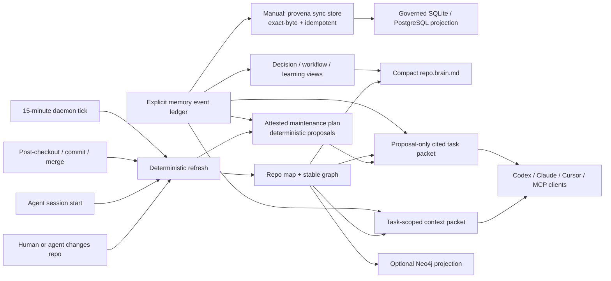

# Provena

[](./docs/PUBLISH_CLI.md)
[](https://github.com/ayushozha/provena/actions/workflows/ci-cli.yml)
[](./cli/package.json)
[](./docs/REPO_MEMORY_ARCHITECTURE.md#mcp-surface)

**A living, provenance-first repository memory for coding agents.**

Provena installs into an existing codebase and creates a compact brain that
Codex, Claude Code, Cursor, Copilot, and other MCP clients can read without
each agent rereading the whole repository. The current refresh implementation
still performs a bounded source scan. It maps files, symbols, packages, commands,
imports, durable decisions, workflows, mistakes, preferences, and handoffs;
then compiles bounded proposal-only maintenance work and keeps those views
current through session boot, Git lifecycle hooks, and a fixed-cadence local
daemon.

`repository-memory` · `context-engineering` · `knowledge-graph` · `MCP` ·
`agent-harness` · `provenance` · `local-first`

## Contents

- [Status at a glance](#status-at-a-glance)
- [Quick start](#quick-start)
- [The repo-brain contract](#the-repo-brain-contract)
- [How it stays alive](#how-it-stays-alive)
- [CLI](#cli)
- [MCP surface](#mcp-surface)
- [Graph and Neo4j](#graph-and-neo4j)
- [Architecture and storage](#architecture-and-storage)
- [Repository map](#repository-map)
- [Verification](#verification)
- [Configuration and lifecycle](#configuration-and-lifecycle)
- [Privacy and security](#privacy-and-security)
- [Roadmap](#roadmap)
- [Contributing](#contributing)
- [License](#license)

## Status at a glance

| Surface | Current status |
|---|---|
| One-click repo brain | Implemented and packed-install tested; install from a source-built tarball until the first npm release |
| Durable memory | Implemented as a validated append-only JSONL event ledger with derived views |
| Procedural memory | Structured candidate capture, explicit human approval, exact-version caller outcome receipts, source freshness, relevance, abstention, and bounded CLI/MCP recall; automatic trace capture and agent execution benchmarks remain roadmap |
| Repo graph | Implemented with stable nodes/edges, PageRank, degree, components, neighborhoods, and shortest paths |
| Agent context | Implemented with exact path/symbol/command ranking, lexical + graph expansion, citations, and hard budgets |
| Maintenance proposals | Implemented as a manifest-attested deterministic plan plus cited task packets; review-only, with no autonomous execution or apply path |
| Agent integrations | Managed Codex, Claude Code, Cursor, Copilot, MCP, Git-hook, session, and daemon surfaces; conflicts/unsupported hooks are preserved and reported |
| Temporal graph / Neo4j | Graph v2 keeps every ledger event, direct lineage, current-source links, and producer-effective intervals; Neo4j projection is opt-in and mock-adapter tested, while live-server proof and incremental CDC remain roadmap |
| Local/server storage | File ledger is the portable core; the Python store supports SQLite FTS/KNN-or-linear vector search and PostgreSQL FTS with a linear vector fallback |
| Model-assisted intelligence | Optional external-model/embedding Python service; deterministic pseudo-vectors are the zero-key fallback, not semantic deep learning |
| Enterprise connected mode | Foundations implemented; first-party SaaS crawlers and a hosted control plane remain roadmap |

## Quick start

`@provena/cli` is not yet published to npm. Build the installable tarball from
this source checkout, then install it in the target Git repository. The tarball
bundles its production dependency tree for a pinned, self-contained portable
runtime:

```powershell
git clone https://github.com/ayushozha/provena.git
Push-Location .\provena\cli
npm ci
npm pack
$ProvenaTarball = (Resolve-Path .\provena-cli-0.1.0.tgz)
Pop-Location

Set-Location C:\path\to\your-repository
npm install --save-dev $ProvenaTarball
npx provena init
```

After the first public release, the registry flow will be:

```powershell
npm install --save-dev @provena/cli
npx provena init
# or, without adding a dependency first:
npx @provena/cli init
```

`init` performs the complete local installation:

- creates `.provena/repo.brain.md`, the small agent bootloader;
- creates deterministic repo map, graph, maintenance plan, manifest, JSON Schema, and memory views;
- initializes the append-only `.provena/memory/events.jsonl` ledger;
- persists an ignored local runtime so future refreshes do not depend on the npm cache;
- installs managed instructions for Codex, Claude Code, Cursor, and Copilot;
- installs project-scoped MCP configs;
- installs safe repo-local Git refresh hooks when the repository hook path permits it;
- starts a 15-minute refresh daemon.

Use `--no-daemon`, `--no-hooks`, `--no-mcp`, `--no-agents`, or `--no-runtime`
to opt out of individual integrations. Existing files are preserved through
managed blocks. Because hooks, MCP, and the daemon invoke the persisted runtime,
`--no-runtime` must be combined with `--no-hooks --no-mcp --no-daemon`.
Provena refuses to modify a user-global Git hooks directory.

Then use the brain:

```powershell
npx provena context "change authentication without breaking session refresh"
npx provena maintain plan --limit 10
$MaintenanceTask = "task-id-from-the-plan"
npx provena maintain context $MaintenanceTask --max-tokens 1500
npx provena remember decision "Keep auth checks at the gateway" `
  --authority human `
  --body "The gateway remains the authorization boundary." `
  --source "gateway/auth.go:42" `
  --rationale "Downstream services receive a verified principal."
npx provena graph neighbors gateway/auth.go --hops 2
npx provena checkpoint --summary "Auth change implemented and tests pass" `
  --authority human `
  --next "Run the deployment smoke test"
npx provena harness verify
```

For reusable tool sequences, follow the [procedure lifecycle](./docs/PROCEDURAL_MEMORY.md):
capture a structured episode, review it with `provena procedure inspect`, approve
the exact version manually, and record a goal-verification receipt. Use
`provena procedure recall "<task>" --json` before reuse. Success receipts are
caller attestations to verify; stored steps do not grant tool permissions.

## The repo-brain contract

Tracked, clone-portable memory:

```text
.provena/
├── config.json                    # repository identity, store scope, scan globs
├── repo.brain.md                 # compact first-read bootloader
├── repo.map.json                 # files, symbols, packages, commands, env names, imports
├── graph.json                    # typed repository graph
├── maintenance.plan.json         # attested, bounded review proposals
├── manifest.json                 # source/memory fingerprints + artifact hashes
├── agent-instructions.md         # shared agent boot protocol
├── schema/
│   └── memory-event.schema.json  # canonical ledger schema
├── memory/
│   └── events.jsonl              # append-only durable memory source of truth
└── views/
    ├── decisions.md
    ├── workflows.md
    └── learnings.md
```

Ignored, machine-local state:

```text
.provena/cache/       # session records and ephemeral state
.provena/context/     # generated task packets
.provena/runtime/     # persisted package runtime
.provena/logs/        # operational logs
.provena/*.db         # optional standalone store
.provena/daemon.*     # daemon process/log/control state
```

Outside `.provena/`, `init` may add managed blocks or entries to `AGENTS.md`,
`CLAUDE.md`, `.github/copilot-instructions.md`, `.cursor/rules/provena.mdc`,
`.mcp.json`, `.codex/config.toml`, `.vscode/mcp.json`, and eligible repo-local
Git hooks. Existing conflicting MCP entries and unsupported hooks are preserved
and reported.

In the current checkout, `npm pack --dry-run --json` reports an archive of
about 11 MB and about 86 MB unpacked (113 bundled production packages). The
ignored `.provena/runtime/` footprint is therefore materially larger than the
tracked brain; exact size changes with the dependency lockfile.

Tracked outputs contain only repository-relative paths and use stable ordering
for a given supported checkout/runtime. Generated summaries can be rebuilt;
the current source tree and append-only ledger remain authoritative.

## How it stays alive



Each refresh currently scans and hashes eligible repository files and compiles
the maintenance plan from the committed map plus canonical active ledger heads;
the roadmap replaces source scanning with an incremental change journal. Agents
consume the compact artifacts and task packets rather than repeating that work
themselves. Maintenance is review-only: no refresh, command, or MCP read spawns
agents, approves proposals, or changes durable memory on their behalf.

Provena does not infer human preferences or architectural rationale from code.
Those claims require an explicit `remember` event. Observed repository facts
are regenerated from source, while decisions and learnings remain append-only
and can supersede earlier events without rewriting history.

## CLI

| Command | Purpose |
|---|---|
| `provena init` | Install the complete local memory system |
| `provena refresh` / `index` | Rebuild deterministic brain, map, graph, maintenance plan, schema, and views |
| `provena context "task"` / `search` | Produce a cited, budgeted context packet |
| `provena maintain plan [--limit N]` | Refresh once, then list a bounded view of deterministic review proposals |
| `provena maintain context <task-id>` | Refresh once, then compile one cited proposal packet under the requested token budget |
| `provena remember` | Append an explicit typed memory |
| `provena procedure learn\|approve\|outcome\|recall\|inspect` | Capture, review, attest, and retrieve structured procedures with current evidence |
| `provena checkpoint` | Record a source-aware handoff |
| `provena session start` | Refresh, persist local session state, and emit boot context |
| `provena status` | Report freshness, memories, daemon, and integrations |
| `provena graph` | Run graph algorithms or `sync neo4j` |
| `provena mcp install\|serve` | Install stdio configs, serve stdio, or opt into loopback HTTP |
| `provena agents install` | Repair/update managed agent instructions |
| `provena daemon start\|stop\|status` | Control fixed-cadence refresh |
| `provena sync store [--json\|--dry-run]` | Verify and atomically project the canonical ledger into governed storage |
| `provena harness verify` | Check determinism, hashes, graph integrity, citations, and budgets |
| `provena index --store` / `search --store` | Use the optional legacy governed-memory service |

## MCP surface

The default local stdio server exposes five resources for the brain, map, graph,
manifest, and public/internal active memories, plus these ten tools:

- `provena_context`
- `provena_refresh`
- `provena_remember`
- `provena_graph_neighbors`
- `provena_graph_path`
- `provena_maintenance_plan` (read-only bounded plan view)
- `provena_maintenance_context` (read-only cited task packet)
- `provena_procedure_learn` (candidate capture)
- `provena_procedure_outcome` (caller-reported result)
- `provena_procedure_recall` (read-only eligibility and freshness checks)

Human procedure approval is an explicit local CLI action. The MCP server does
not expose an approval tool. See [procedural memory](./docs/PROCEDURAL_MEMORY.md)
for schemas, budgets, compatibility limits, and evaluation evidence.

The full attested artifact is `.provena/maintenance.plan.json`; the CLI and MCP
plan listings return bounded view envelopes that reference the canonical plan
fingerprint without presenting a sliced task list as the attested artifact.
The maintenance context
surfaces use exact eligible memory IDs and paths while preserving sensitivity,
effective-time, citation, and token-budget rules. Ordinary `provena context`
also accepts repeatable `--memory-id <event-id>` selectors (up to 32).

The Git-tracked ledger accepts only `public` and `internal` events.
`confidential` and `restricted` writes are rejected and belong in the optional
governed store. Likely raw credentials are rejected as a best-effort guard.
MCP uses the official TypeScript SDK rather than a custom protocol
implementation.

Clients that cannot launch stdio can opt into the same repository-bound surface:

```powershell
npx provena mcp serve --http                 # http://127.0.0.1:18093/mcp
npx provena mcp serve --http --port 19093    # explicit local port
```

`GET /healthz` is the bounded health check. The server stays in the foreground;
press Ctrl+C to stop it. It binds only `127.0.0.1`, creates no durable HTTP
session state, and does not change managed client configs from stdio. This is
an unauthenticated local-process boundary: any process on the machine can call
both read and mutation tools while it is running. It is not a remote or
enterprise endpoint and provides no TLS, authentication, permissive CORS,
SSE/session mode, daemonization, rate limiting, or remote binding.

## Graph and Neo4j

The portable graph is a deterministic JSON projection with repository,
directory, file, symbol, package, command, dependency, environment, and
namespaced memory nodes. In addition to code relationships, graph v2 projects
direct `supersedes`, `cites`, and `applies_to` edges from every canonical ledger
event. Memory nodes carry a bounded indexing payload and half-open
producer-effective intervals; bodies and arbitrary structured data stay in the
ledger. Built-in algorithms are dependency-free and deterministic.

Temporal queries intentionally have one time axis. `--memory-as-of` selects the
active ledger heads effective at an exact UTC millisecond while repository
files, symbols, imports, and commands remain the current snapshot. A later
backdated event can revise an earlier effective view. Provena does not yet claim
transaction-time history, bi-temporal facts, or historical repository maps.

```powershell
npx provena context "authentication" --memory-as-of 2026-07-13T12:00:00.000Z
npx provena graph stats --memory-as-of 2026-07-13T12:00:00.000Z --json
npx provena graph timeline <memory-event-id>
```

Neo4j synchronization is opt-in. It rebuilds the same current-code plus full
effective-time memory graph under a projection fingerprint derived from the
source fingerprint and exact raw-ledger fingerprint. Stale cleanup is scoped to
that projection identity:

```powershell
$env:PROVENA_NEO4J_URI = "neo4j+s://your-instance.databases.neo4j.io"
$env:PROVENA_NEO4J_USERNAME = "neo4j"
$env:PROVENA_NEO4J_PASSWORD = "<from-your-secret-manager>"
$env:PROVENA_NEO4J_DATABASE = "neo4j" # optional
npx provena graph sync neo4j
```

Credentials are read only from environment variables and are never written to
the tracked brain or sent as Cypher parameters. Adapter behavior is covered by
a mock driver; this repository does not claim a live Neo4j integration run.

## Architecture and storage

The installable repo brain is the zero-service path. The wider Provena
platform remains available when a team needs shared, multi-tenant memory:

| Responsibility | Implementation |
|---|---|
| Portable truth | Tracked JSONL event ledger + deterministic derived artifacts |
| Maintenance review | Manifest-attested deterministic proposals + proposal-only cited task packets |
| Canonical bridge | Exact-byte SHA-256 verification, immutable event mapping, atomic SQL projection, and durable sync checkpoint |
| Local operational memory | SQLite FTS5 + sqlite-vec KNN when available, otherwise linear cosine |
| Production operational memory | PostgreSQL/tsvector with linear cosine fallback; pgvector KNN is roadmap |
| Fast triggers/cache | Rust trigger index and Redis-backed service paths |
| Repo relationship analytics | Local graph algorithms; optional Neo4j projection |
| ML/LLM intelligence | Optional Python classification, embedding, reranking, conflict, and evaluation pipelines |
| Governance | Tenant scope, ACLs, retention, legal hold, RTBF, audit, integration coverage |

Routing memory to a database merely because it is “SQL” or “NoSQL” creates
split-brain ownership. Provena instead keeps one canonical event contract and
uses purpose-built, rebuildable projections. MongoDB is not bundled today;
future adapters must implement the same event/provenance contract and pass the
conformance harness before they can become authoritative projections.

See [Repo Memory Architecture](./docs/REPO_MEMORY_ARCHITECTURE.md),
[Enterprise Memory Plan](./docs/ENTERPRISE_MEMORY_PLAN.md), and the existing
[service architecture](./ARCHITECTURE.md).

## Repository map

| Path | Role |
|---|---|
| `cli/` | Installable repo brain, graph, context, MCP, agent integrations, and tests |
| `app/`, `storage/` | Python standalone store and persistence backends |
| `intelligence/` | Optional write/read intelligence and evaluation pipelines |
| `control-plane/` | Go gateway/control-plane surfaces |
| `orchestration/` | Rust trigger, budget, and prompt-assembly hot path |
| `control-plane/cmd/mcp/` | Go MCP service for the polyglot deployment |
| `sdk/` | TypeScript, Python, Go, and Rust SDKs |
| `loop/` | Provena's PM → tester → engineer autonomous delivery harness |
| `docs/` | Quick starts, contracts, and architecture guidance |

## Verification

With the root and intelligence Python packages plus `pytest` installed in
`.venv`, and the Go and Rust toolchains available on `PATH`:

```powershell
cd cli
npm ci
npm test
node eval/procedure-behavior.mjs

cd ..
.\.venv\Scripts\python.exe scripts\run_e2e.py
```

The CLI gate includes unit tests, schema/event tests, graph algorithms, context
budgeting, MCP in-memory protocol tests, Neo4j projection tests, index rollback
regressions, and a packed tarball installed into a fresh consumer repository.
The repository E2E runner adds the Python, Go, Rust, standalone, and polyglot
contract checks.

The frozen offline procedure fixture passes 13/13 lifecycle and eligibility
cases, including unrelated-task abstention, source changes, failed outcomes,
and constrained budgets. These are synthetic receipts, not executed coding-agent
tasks or competitor measurements. We have not established a universal quality,
cost, or latency advantage over Memorable, Mem0, Letta, Graphiti, or other systems.

## Configuration and lifecycle

The default `development` environment explicitly permits the legacy local-only
no-auth path. Non-local deployments require the tenant-bound service token
documented in [DEPLOYMENT.md](./DEPLOYMENT.md).

Polyglot deployments keep credentials separated: external API keys stop at the
gateway; `PROVENA_GATEWAY_SERVICE_TOKEN` authenticates the private gateway
transport at intelligence, store, and lifecycle ingress; `PROVENA_QUEUE_INGRESS_TOKEN` authenticates queue callers but is
never used for downstream writes; and each lifecycle process has a distinct
admin service token bound to one tenant. Copy [.env.example](./.env.example)
and replace every blank credential through your secret manager before enabling
production authentication or the queue.

Hosted intelligence search budgets count memory content using a conservative
four-character token estimate rounded up. They exclude response metadata and
citations. Portable procedure recall instead bounds its complete serialized JSON;
neither estimate is a provider tokenizer measurement.

```powershell
$env:PROVENA_DB_PATH = ".\\data\\provena.db"
python -m uvicorn app.main:app --reload --port 8092
```

`.provena/config.json` records the repository UUID, tenant/project identity,
schema version, optional-store URL/database path, the fixed non-secret
`store_api_key_env` name (`PROVENA_API_KEY`), and scan include/exclude globs. Neo4j
credentials and optional service settings stay in environment variables; they
are never written into tracked artifacts. The default portable path is stdio
and opens no port; explicit `mcp serve --http` opens the foreground loopback
endpoint on `127.0.0.1:18093`. The CLI-managed optional store remains separate
and defaults to `127.0.0.1:18092`; polyglot service ports are listed in
[ARCHITECTURE.md](./ARCHITECTURE.md#service-topology).

After a fresh clone, run `npx provena init` to recreate the ignored runtime,
daemon state, hooks, and MCP/client configs from the committed brain. Run the
same command after upgrading the package to repair managed integrations and
refresh artifacts. To remove Provena, stop the daemon, remove its managed
instruction/config/hook blocks, uninstall `@provena/cli`, and delete `.provena/`
only after preserving any ledger events you still need. Dedicated automated
`upgrade` and `uninstall` commands are roadmap.

The packaged Compose stack keeps the store's internal port `8000` private and
publishes host ports `50051`, `8080`, `8081`, `8090`, `8091`, and `8092` on
`127.0.0.1` by default. Each published address and port is overrideable for an
operator-managed deployment. Set the matching `*_HOST_BIND` and `*_HOST_PORT`
environment variables before `docker compose up`, for example:

```powershell
$env:PROVENA_GATEWAY_HOST_BIND = "127.0.0.1"
$env:PROVENA_GATEWAY_HOST_PORT = "18080"
docker compose up --build -d
```

MCP follows the same loopback-safe default. Expose it beyond the local host only
when gateway authentication and external network policy are already in place.

### Private NeverZero integration

NeverZero's coordination worker talks directly to the store so deterministic
memory IDs survive projection. Provena Compose creates the shared bridge
network and NeverZero joins it as an external network; Provena advertises only the private
`provena-store:8000` alias on that network. The store still has no host port.

Start the Provena store first to create the network, then start NeverZero's
worker from the NeverZero checkout:

```powershell
# In the Provena checkout; configure .env first.
docker compose up --build -d store

# In the NeverZero checkout; use the same network, token, and tenant in .env.
docker compose --profile coordination up --build -d coordination-worker
```

The matching variables are:

- `PROVENA_INTEGRATION_NETWORK=neverzero-provena` in both repositories;
- Provena `PROVENA_SERVICE_TOKEN` = NeverZero `PROVENA_API_KEY`;
- Provena `PROVENA_SERVICE_TENANT_ID` = NeverZero `PROVENA_TENANT_ID`;
- Provena `PROVENA_SERVICE_PRINCIPAL_ID` = NeverZero
  `PROVENA_SERVICE_PRINCIPAL`;
- NeverZero `PROVENA_STORE_URL=http://provena-store:8000`.

The single-token variables above are the smallest tenant-dedicated setup. A
shared private store can instead set `PROVENA_SERVICE_IDENTITIES` to a JSON
array of `{token_sha256, tenant_id, principal_id, role}` entries. Each
NeverZero worker keeps its raw token in its secret manager and supplies the
matching tenant; Provena stores only the token digest in configuration and
ignores caller-supplied identity headers. Keep the shared network private.

### Export OpenAPI

```powershell
python .\scripts\export_openapi.py
```

## Privacy and security

- A best-effort detector rejects common secret-like material and private keys
  from CLI and MCP memory writes; it is not a confidentiality boundary.
- Secret files, symlinks, binaries, generated directories, and oversized files
  are excluded from repo scanning. Safe environment templates contribute
  variable names only, never values.
- Agent/MCP/Git config writes preserve existing content and refuse symlink targets.
- Repo-brain readers verify every managed artifact against both deterministic
  regeneration and the manifest before MCP serves its captured bytes; tampered
  bootloaders, schemas, maps, graphs, plans, ledgers, or views fail closed.
- The opt-in HTTP MCP listener is loopback-only and unauthenticated; any local
  process can invoke its read and mutation tools until the foreground process stops.
- Global Git hook paths are never modified.
- Confidential/restricted writes are rejected from the tracked ledger; the
  optional governed store owns sensitive memory.
- Authenticated gateway identity and groups come from API-key claims; inbound
  `X-Provena-*` identity headers are stripped before proxying.
- Model selection remains environment/config driven; the repo brain requires no model.
- Memory is evidence, not authority: agents must verify cited source before edits.
- Maintenance plans contain bounded IDs, paths, fingerprints, counters, and
  fixed planner fields rather than memory bodies, provenance, source snippets,
  environment values, or credentials.

## Roadmap

Near-term work is tracked honestly as roadmap rather than generated capability:

- richer language-native parsers beyond the current multi-language symbol scan;
- quality eval datasets with measured recall/NDCG and no synthetic baselines;
- background change journals instead of bounded full-tree hashing;
- transaction-time/bi-temporal history, historical repository maps, and
  incremental Neo4j CDC;
- repository bootstrap summaries beyond conservative source-derived facts;
- semantic consolidation/decay, autonomous subagent DAG coordination and
  execution, automatic proposal approval/application, and task-outcome evaluation;
- dedicated upgrade/uninstall commands and a signed release channel;
- enterprise identity/permission sync and first-party connectors;
- adapter conformance for additional stores such as MongoDB;
- hosted fleet policy, observability, backups, and graph analytics;
- learned ranking and embeddings as optional projections with deterministic
  lexical/graph fallback.

## Contributing

Keep the following invariants:

1. The packed CLI must work in an unrelated repository without Python.
2. Tracked artifacts must be deterministic, clone-portable, and secret-free.
3. Decisions, preferences, and rationale are explicit—never inferred.
4. Every retrieved memory carries a source or memory citation.
5. Optional databases and models may improve projections but cannot break the
   local boot path or become an undocumented source of truth.
6. Run `npm test` and the relevant service tests before opening a PR.

## License

No license file is currently checked in. Treat the repository as all rights
reserved until the maintainers add an explicit license.
