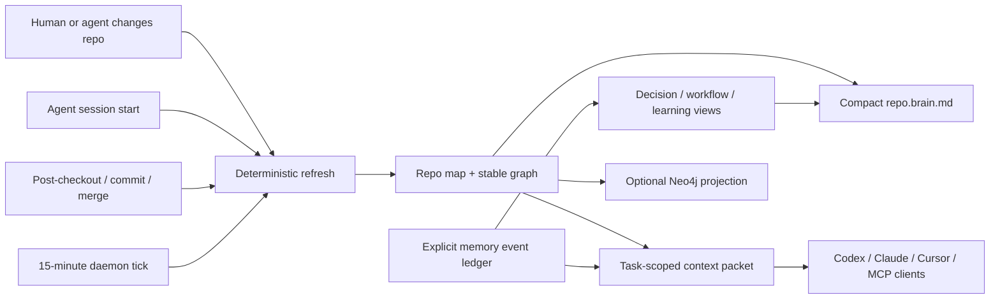

# Provena

[](./docs/PUBLISH_CLI.md)
[](https://github.com/ayushozha/provena/actions/workflows/ci-cli.yml)
[](./cli/package.json)
[](./docs/REPO_MEMORY_ARCHITECTURE.md#mcp-surface)

**A living, provenance-first repository memory for coding agents.**

Provena installs into an existing codebase and creates a compact brain that
Codex, Claude Code, Cursor, Copilot, and other MCP clients can read without
each agent rereading the whole repository. The current refresh implementation
still performs a bounded source scan. It maps files, symbols, packages, commands,
imports, durable decisions, workflows, mistakes, preferences, and handoffs;
then keeps those views current through session boot, Git lifecycle hooks, and a
fixed-cadence local daemon.

`repository-memory` · `context-engineering` · `knowledge-graph` · `MCP` ·
`agent-harness` · `provenance` · `local-first`

## Contents

- [Status at a glance](#status-at-a-glance)
- [Quick start](#quick-start)
- [The repo-brain contract](#the-repo-brain-contract)
- [How it stays alive](#how-it-stays-alive)
- [CLI](#cli)
- [MCP surface](#mcp-surface)
- [Graph and Neo4j](#graph-and-neo4j)
- [Architecture and storage](#architecture-and-storage)
- [Configuration and lifecycle](#configuration-and-lifecycle)
- [Roadmap](#roadmap)

## Status at a glance

| Surface | Current status |
|---|---|
| One-click repo brain | Implemented and packed-install tested; install from a source-built tarball until the first npm release |
| Durable memory | Implemented as a validated append-only JSONL event ledger with derived views |
| Repo graph | Implemented with stable nodes/edges, PageRank, degree, components, neighborhoods, and shortest paths |
| Agent context | Implemented with exact path/symbol/command ranking, lexical + graph expansion, citations, and hard budgets |
| Agent integrations | Managed Codex, Claude Code, Cursor, Copilot, MCP, Git-hook, session, and daemon surfaces; conflicts/unsupported hooks are preserved and reported |
| Neo4j | Opt-in projection of the current code graph; temporal memory/event graph and incremental CDC are roadmap |
| Local/server storage | File ledger is the portable core; the Python store supports SQLite FTS/KNN-or-linear vector search and PostgreSQL FTS with a linear vector fallback |
| Deep-learning intelligence | Optional Python intelligence service; not required by one-click local boot |
| Enterprise connected mode | Foundations implemented; first-party SaaS crawlers and a hosted control plane remain roadmap |

## Quick start

`@provena/cli` is not yet published to npm. Build the installable tarball from
this source checkout, then install it in the target Git repository. The tarball
bundles its production dependency tree for a pinned, self-contained portable
runtime:

```powershell
git clone https://github.com/ayushozha/provena.git
Push-Location .\provena\cli
npm ci
npm pack
$ProvenaTarball = (Resolve-Path .\provena-cli-0.1.0.tgz)
Pop-Location

Set-Location C:\path\to\your-repository
npm install --save-dev $ProvenaTarball
npx provena init
```

After the first public release, the registry flow will be:

```powershell
npm install --save-dev @provena/cli
npx provena init
# or, without adding a dependency first:
npx @provena/cli init
```

`init` performs the complete local installation:

- creates `.provena/repo.brain.md`, the small agent bootloader;
- creates deterministic repo map, graph, manifest, JSON Schema, and memory views;
- initializes the append-only `.provena/memory/events.jsonl` ledger;
- persists an ignored local runtime so future refreshes do not depend on the npm cache;
- installs managed instructions for Codex, Claude Code, Cursor, and Copilot;
- installs project-scoped MCP configs;
- installs safe repo-local Git refresh hooks when the repository hook path permits it;
- starts a 15-minute refresh daemon.

Use `--no-daemon`, `--no-hooks`, `--no-mcp`, `--no-agents`, or `--no-runtime`
to opt out of individual integrations. Existing files are preserved through
managed blocks. Because hooks, MCP, and the daemon invoke the persisted runtime,
`--no-runtime` must be combined with `--no-hooks --no-mcp --no-daemon`.
Provena refuses to modify a user-global Git hooks directory.

Then use the brain:

```powershell
npx provena context "change authentication without breaking session refresh"
npx provena remember decision "Keep auth checks at the gateway" `
  --authority human `
  --body "The gateway remains the authorization boundary." `
  --source "gateway/auth.go:42" `
  --rationale "Downstream services receive a verified principal."
npx provena graph neighbors gateway/auth.go --hops 2
npx provena checkpoint --summary "Auth change implemented and tests pass" `
  --authority human `
  --next "Run the deployment smoke test"
npx provena harness verify
```

## The repo-brain contract

Tracked, clone-portable memory:

```text
.provena/
├── config.json                    # repository identity, store scope, scan globs
├── repo.brain.md                 # compact first-read bootloader
├── repo.map.json                 # files, symbols, packages, commands, env names, imports
├── graph.json                    # typed repository graph
├── manifest.json                 # source/memory fingerprints + artifact hashes
├── agent-instructions.md         # shared agent boot protocol
├── schema/
│   └── memory-event.schema.json  # canonical ledger schema
├── memory/
│   └── events.jsonl              # append-only durable memory source of truth
└── views/
    ├── decisions.md
    ├── workflows.md
    └── learnings.md
```

Ignored, machine-local state:

```text
.provena/cache/       # session records and ephemeral state
.provena/context/     # generated task packets
.provena/runtime/     # persisted package runtime
.provena/logs/        # operational logs
.provena/*.db         # optional standalone store
.provena/daemon.*     # daemon process/log/control state
```

Outside `.provena/`, `init` may add managed blocks or entries to `AGENTS.md`,
`CLAUDE.md`, `.github/copilot-instructions.md`, `.cursor/rules/provena.mdc`,
`.mcp.json`, `.codex/config.toml`, `.vscode/mcp.json`, and eligible repo-local
Git hooks. Existing conflicting MCP entries and unsupported hooks are preserved
and reported.

In the current checkout, `npm pack --dry-run --json` reports an archive of
about 10 MB and about 78 MB unpacked (127 bundled production packages). The
ignored `.provena/runtime/` footprint is therefore materially larger than the
tracked brain; exact size changes with the dependency lockfile.

Tracked outputs contain only repository-relative paths and use stable ordering
for a given supported checkout/runtime. Generated summaries can be rebuilt;
the current source tree and append-only ledger remain authoritative.

## How it stays alive



Each refresh currently scans and hashes eligible repository files; the roadmap
replaces this with an incremental change journal. Agents consume the compact
artifacts and task packets rather than repeating that work themselves.

Provena does not infer human preferences or architectural rationale from code.
Those claims require an explicit `remember` event. Observed repository facts
are regenerated from source, while decisions and learnings remain append-only
and can supersede earlier events without rewriting history.

## CLI

| Command | Purpose |
|---|---|
| `provena init` | Install the complete local memory system |
| `provena refresh` / `index` | Rebuild deterministic brain, map, graph, schema, and views |
| `provena context "task"` / `search` | Produce a cited, budgeted context packet |
| `provena remember` | Append an explicit typed memory |
| `provena checkpoint` | Record a source-aware handoff |
| `provena session start` | Refresh, persist local session state, and emit boot context |
| `provena status` | Report freshness, memories, daemon, and integrations |
| `provena graph` | Run graph algorithms or `sync neo4j` |
| `provena mcp install\|serve` | Install MCP configs or serve stdio MCP |
| `provena agents install` | Repair/update managed agent instructions |
| `provena daemon start\|stop\|status` | Control fixed-cadence refresh |
| `provena harness verify` | Check determinism, hashes, graph integrity, citations, and budgets |
| `provena index --store` / `search --store` | Use the optional legacy governed-memory service |

## MCP surface

The local stdio server exposes resources for the brain, map, graph, manifest,
and public/internal active memories, plus these tools:

- `provena_context`
- `provena_refresh`
- `provena_remember`
- `provena_graph_neighbors`
- `provena_graph_path`

The Git-tracked ledger accepts only `public` and `internal` events.
`confidential` and `restricted` writes are rejected and belong in the optional
governed store. Likely raw credentials are rejected as a best-effort guard.
MCP uses the official TypeScript SDK rather than a custom protocol
implementation.

## Graph and Neo4j

The portable graph is a deterministic JSON projection with repository,
directory, file, symbol, package, command, dependency, and environment nodes,
plus containment, definition, declaration, import, dependency, and `uses`
relationships. Built-in algorithms are dependency-free and deterministic.

Neo4j synchronization is opt-in. It projects the current code topology; it is
not yet a temporal history or cross-repository memory graph:

```powershell
$env:PROVENA_NEO4J_URI = "neo4j+s://your-instance.databases.neo4j.io"
$env:PROVENA_NEO4J_USERNAME = "neo4j"
$env:PROVENA_NEO4J_PASSWORD = "<from-your-secret-manager>"
$env:PROVENA_NEO4J_DATABASE = "neo4j" # optional
npx provena graph sync neo4j
```

Credentials are read only from environment variables and are never written to
the tracked brain or sent as Cypher parameters.

## Architecture and storage

The installable repo brain is the zero-service path. The wider Provena
platform remains available when a team needs shared, multi-tenant memory:

| Responsibility | Implementation |
|---|---|
| Portable truth | Tracked JSONL event ledger + deterministic derived artifacts |
| Local operational memory | SQLite FTS5 + sqlite-vec KNN when available, otherwise linear cosine |
| Production operational memory | PostgreSQL/tsvector with linear cosine fallback; pgvector KNN is roadmap |
| Fast triggers/cache | Rust trigger index and Redis-backed service paths |
| Repo relationship analytics | Local graph algorithms; optional Neo4j projection |
| ML/LLM intelligence | Optional Python classification, embedding, reranking, conflict, and evaluation pipelines |
| Governance | Tenant scope, ACLs, retention, legal hold, RTBF, audit, integration coverage |

Routing memory to a database merely because it is “SQL” or “NoSQL” creates
split-brain ownership. Provena instead keeps one canonical event contract and
uses purpose-built, rebuildable projections. MongoDB is not bundled today;
future adapters must implement the same event/provenance contract and pass the
conformance harness before they can become authoritative projections.

See [Repo Memory Architecture](./docs/REPO_MEMORY_ARCHITECTURE.md),
[Enterprise Memory Plan](./docs/ENTERPRISE_MEMORY_PLAN.md), and the existing
[service architecture](./ARCHITECTURE.md).

## Repository map

| Path | Role |
|---|---|
| `cli/` | Installable repo brain, graph, context, MCP, agent integrations, and tests |
| `app/`, `storage/` | Python standalone store and persistence backends |
| `intelligence/` | Optional write/read intelligence and evaluation pipelines |
| `control-plane/` | Go gateway/control-plane surfaces |
| `orchestration/` | Rust trigger, budget, and prompt-assembly hot path |
| `control-plane/cmd/mcp/` | Go MCP service for the polyglot deployment |
| `sdk/` | TypeScript, Python, Go, and Rust SDKs |
| `loop/` | Provena's PM → tester → engineer autonomous delivery harness |
| `docs/` | Quick starts, contracts, and architecture guidance |

## Verification

```powershell
cd cli
npm ci
npm test

cd ..
.\.venv\Scripts\python.exe -m pytest tests -q
```

The CLI gate includes unit tests, schema/event tests, graph algorithms, context
budgeting, MCP in-memory protocol tests, Neo4j projection tests, index rollback
regressions, and a packed tarball installed into a fresh consumer repository.

## Configuration and lifecycle

The default `development` environment explicitly permits the legacy local-only
no-auth path. Non-local deployments require the tenant-bound service token
documented in [DEPLOYMENT.md](./DEPLOYMENT.md).

Polyglot deployments keep credentials separated: external API keys stop at the
gateway; `PROVENA_GATEWAY_SERVICE_TOKEN` authenticates the private gateway
transport at intelligence, store, and lifecycle ingress; `PROVENA_QUEUE_INGRESS_TOKEN` authenticates queue callers but is
never used for downstream writes; and each lifecycle process has a distinct
admin service token bound to one tenant. Copy [.env.example](./.env.example)
and replace every blank credential through your secret manager before enabling
production authentication or the queue.

```powershell
$env:PROVENA_DB_PATH = ".\\data\\provena.db"
python -m uvicorn app.main:app --reload --port 8092
```

`.provena/config.json` records the repository UUID, tenant/project identity,
schema version, optional-store URL/database path, and scan include/exclude
globs. Neo4j
credentials and optional service settings stay in environment variables; they
are never written into tracked artifacts. The portable path opens no network
port. The CLI-managed optional store defaults to `127.0.0.1:18092`; the polyglot
service ports are listed in [ARCHITECTURE.md](./ARCHITECTURE.md#service-topology).

After a fresh clone, run `npx provena init` to recreate the ignored runtime,
daemon state, hooks, and MCP/client configs from the committed brain. Run the
same command after upgrading the package to repair managed integrations and
refresh artifacts. To remove Provena, stop the daemon, remove its managed
instruction/config/hook blocks, uninstall `@provena/cli`, and delete `.provena/`
only after preserving any ledger events you still need. Dedicated automated
`upgrade` and `uninstall` commands are roadmap.

The packaged Compose stack keeps the store's internal port `8000` private and
publishes host ports `50051`, `8080`, `8081`, `8090`, `8091`, and `8092` on
`127.0.0.1` by default. Each published address and port is overrideable for an
operator-managed deployment. Set the matching `*_HOST_BIND` and `*_HOST_PORT`
environment variables before `docker compose up`, for example:

```powershell
$env:PROVENA_GATEWAY_HOST_BIND = "127.0.0.1"
$env:PROVENA_GATEWAY_HOST_PORT = "18080"
docker compose up --build -d
```

MCP follows the same loopback-safe default. Expose it beyond the local host only
when gateway authentication and external network policy are already in place.

### Private NeverZero integration

NeverZero's coordination worker talks directly to the store so deterministic
memory IDs survive projection. The two Compose projects share an
operator-created external network; Provena advertises only the private
`provena-store:8000` alias on that network. The store still has no host port.

Create the network once, start the Provena store first, then start NeverZero's
worker from the NeverZero checkout:

```powershell
docker network create neverzero-provena # skip when it already exists

# In the Provena checkout; configure .env first.
docker compose up --build -d store

# In the NeverZero checkout; use the same network, token, and tenant in .env.
docker compose --profile coordination up --build -d coordination-worker
```

The matching variables are:

- `PROVENA_INTEGRATION_NETWORK=neverzero-provena` in both repositories;
- Provena `PROVENA_SERVICE_TOKEN` = NeverZero `PROVENA_API_KEY`;
- Provena `PROVENA_SERVICE_TENANT_ID` = NeverZero `PROVENA_TENANT_ID`;
- Provena `PROVENA_SERVICE_PRINCIPAL_ID` = NeverZero
  `PROVENA_SERVICE_PRINCIPAL`;
- NeverZero `PROVENA_STORE_URL=http://provena-store:8000`.

The single-token variables above are the smallest tenant-dedicated setup. A
shared private store can instead set `PROVENA_SERVICE_IDENTITIES` to a JSON
array of `{token_sha256, tenant_id, principal_id, role}` entries. Each
NeverZero worker keeps its raw token in its secret manager and supplies the
matching tenant; Provena stores only the token digest in configuration and
ignores caller-supplied identity headers. Keep the shared network private.

### Export OpenAPI

```powershell
python .\scripts\export_openapi.py
```

## Privacy and security

- A best-effort detector rejects common secret-like material and private keys
  from CLI and MCP memory writes; it is not a confidentiality boundary.
- Secret files, symlinks, binaries, generated directories, and oversized files
  are excluded from repo scanning. Safe environment templates contribute
  variable names only, never values.
- Agent/MCP/Git config writes preserve existing content and refuse symlink targets.
- Global Git hook paths are never modified.
- Confidential/restricted writes are rejected from the tracked ledger; the
  optional governed store owns sensitive memory.
- Model selection remains environment/config driven; the repo brain requires no model.
- Memory is evidence, not authority: agents must verify cited source before edits.

## Roadmap

Near-term work is tracked honestly as roadmap rather than generated capability:

- richer language-native parsers beyond the current multi-language symbol scan;
- quality eval datasets with measured recall/NDCG and no synthetic baselines;
- background change journals instead of bounded full-tree hashing;
- temporal memory/event graph history and incremental Neo4j updates;
- repository bootstrap summaries beyond conservative source-derived facts;
- first-class subagent DAG coordination and task-outcome evaluation;
- dedicated upgrade/uninstall commands and a signed release channel;
- enterprise identity/permission sync and first-party connectors;
- adapter conformance for additional stores such as MongoDB;
- hosted fleet policy, observability, backups, and graph analytics;
- learned ranking and embeddings as optional projections with deterministic
  lexical/graph fallback.

## Contributing

Keep the following invariants:

1. The packed CLI must work in an unrelated repository without Python.
2. Tracked artifacts must be deterministic, clone-portable, and secret-free.
3. Decisions, preferences, and rationale are explicit—never inferred.
4. Every retrieved memory carries a source or memory citation.
5. Optional databases and models may improve projections but cannot break the
   local boot path or become an undocumented source of truth.
6. Run `npm test` and the relevant service tests before opening a PR.

## License

No license file is currently checked in. Treat the repository as all rights
reserved until the maintainers add an explicit license.
