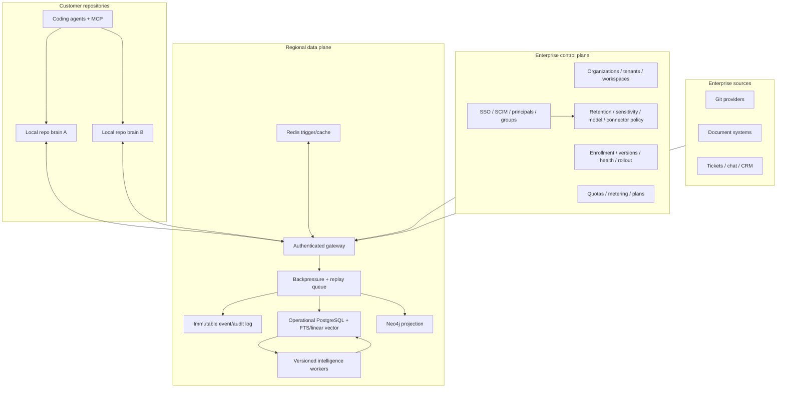

# Provena Enterprise Repository Memory Plan

This is the product and architecture contract for taking the local repo brain
into a managed enterprise memory plane. It separates what is implemented from
what must still be built; provider names are not claims that a connector exists.

## Product shape

Enterprise Provena should let an organization install the same memory contract
across repositories, agents, source systems, and teams while preserving:

- tenant and workspace isolation;
- source ACLs and principal identity;
- append-only provenance and audit;
- retention, legal hold, and right-to-be-forgotten workflows;
- measurable freshness and retrieval quality;
- customer-controlled storage/model policies;
- local operation when the control plane is unavailable.

The local `.provena/` brain remains the repository's bootloader. The enterprise
plane synchronizes policy-approved events and projections; it does not replace
source control as the authority for code.

## Capability matrix

| Capability | Implemented now | Enterprise completion requirement |
|---|---|---|
| Portable repo brain | Yes | Fleet enrollment and signed policy distribution |
| Typed event ledger | Yes | Remote replication, retention classes, legal holds |
| Context packets | Yes | Permission-aware cross-repo retrieval and quality SLOs |
| Graph | Local current-code graph + Neo4j projection | Temporal event graph, tenant federation, incremental CDC, graph policies |
| Operational store | SQLite/PostgreSQL paths exist; PostgreSQL vector search is linear today | pgvector KNN, HA, backup/restore, migrations, capacity automation |
| Identity and ACL | Core service foundations exist | SSO/SCIM, inherited groups, deny-by-default enforcement |
| Connector registry | Provider records exist | Real authenticated workers, webhooks/CDC, freshness SLAs |
| Observability | Service metrics foundations | Fleet dashboards, audit export, retrieval and leakage alerts |
| ML intelligence | Optional pipeline exists | Versioned datasets/models, shadow eval, rollback, cost policy |
| Admin UX | APIs/config today | Hosted console, policy simulator, coverage and incident views |

## Control/data-plane architecture

## Enterprise plans

### Developer

- local repo brain and MCP;
- one user / local storage;
- deterministic graph/context/harness;
- community support.

### Team

- shared workspace memory and cross-repo context;
- managed PostgreSQL/vector search;
- Git provider synchronization;
- team roles, usage limits, and standard retention;
- audit history and quality dashboard.

### Enterprise

- SSO/SAML/OIDC and SCIM;
- custom roles, groups, service accounts, and agent identities;
- source-permission synchronization and deny-by-default retrieval;
- customer-managed encryption keys and regional residency;
- legal hold, RTBF workflows, configurable retention, audit export;
- private networking, self-hosted or dedicated data plane;
- Neo4j fleet graph, advanced graph policy, and cross-repo analytics;
- custom connector/adaptor SDK with conformance certification;
- retrieval, freshness, availability, RPO, and RTO SLOs;
- staged upgrades, support escalation, and incident reporting.

These are plan definitions, not current commercial availability claims.
There is no hosted enterprise control plane, connector worker fleet, SSO/SCIM
service, billing system, or enterprise SLA in the current repository.

## Storage policy

Enterprise storage is routed by access pattern, not by an arbitrary memory-kind
to database table:

| Data | Authority | Projection |
|---|---|---|
| Memory events and audit | Immutable regional ledger | PostgreSQL query model, archive/object storage |
| Current typed memories | PostgreSQL | `tsvector` FTS and linear cosine fallback today; pgvector/approved vector KNN after conformance work |
| Repository graph | Rebuildable from current repo maps | Neo4j current-code projection; temporal memory graph is roadmap |
| Trigger/cache/session | Ephemeral | Redis |
| Local repository boot | Git-tracked `.provena/` | Local JSON/Markdown |

MongoDB and other document/vector stores can be supported behind an adapter
contract, but no adapter becomes authoritative until it passes replay,
supersession, ACL, deletion, backup, and citation conformance tests.

## Identity and authorization

Required enterprise identity objects:

- organization, tenant, workspace, project, repository;
- user, group, service account, agent, session;
- external principal mapping per connector;
- source grant with allow/deny, inheritance, and freshness;
- memory sensitivity and policy tags.

Retrieval must intersect all scopes before ranking. A high similarity score can
never override an ACL denial. Permission caches must be versioned by source and
principal state so a revoked grant cannot be served from stale context.

## Connector contract

A production connector needs more than a provider enum. It must implement:

1. OAuth/service-account authentication without storing raw tokens in memories.
2. Initial crawl, incremental cursor, webhook/CDC path where available.
3. Source identity, version, checksum, deletion/tombstone, and freshness.
4. User/group mapping and permission inheritance.
5. Rate limiting, retries, poison-item isolation, and replay.
6. Coverage metrics and operator-visible error state.
7. A least-privilege security review and revocation flow.

Initial priority should be GitHub/GitLab, Slack/Teams, Google Drive/SharePoint,
Notion/Confluence, Jira/Linear, and email/calendar. None should be marked shipped
until its worker and end-to-end permission tests exist.

## Intelligence and model policy

Classical and deep-learning components are optional, versioned projections:

- lexical/FTS retrieval remains the deterministic fallback;
- graph centrality and neighborhood features remain explainable inputs;
- embeddings add semantic candidates but never remove citations;
- rerankers operate inside an authorization-filtered candidate set;
- classifiers suggest type/sensitivity but high-impact changes require policy;
- conflict/compaction models emit proposed events with provenance;
- model IDs come from environment/deployment config, never application code;
- every model version has a dataset, quality report, cost/latency envelope, and rollback.

Required quality metrics include recall@k, precision, MRR/NDCG, citation
correctness, stale-context rate, authorization-leak rate, contradiction rate,
context tokens per successful task, and task success with/without memory. A
baseline must be actually executed; it cannot be assigned a synthetic zero.

## Reliability and operations

Target contracts before general availability:

- idempotent event ingestion and at-least-once queue replay;
- schema migration and mixed-version compatibility tests;
- regional backup/restore drills with measured RPO/RTO;
- tenant-level quotas and noisy-neighbor controls;
- dead-letter inspection and replay;
- connector freshness/error budgets;
- graph/vector projection rebuild from the canonical ledger;
- offline local brain when remote services are unavailable;
- canary releases and automatic rollback on quality/security regression.

## Delivery sequence

### Phase 1 — Local product hardening

- publish the packed CLI and provenance metadata;
- add more native parsers and incremental change journals;
- expand context eval datasets and harness gates;
- formalize event/adapter compatibility policy.

### Phase 2 — Team memory

- authenticated workspace sync;
- Git provider worker and cross-repo context;
- managed PostgreSQL/vector projection;
- basic roles, retention, audit, and quality dashboard.

### Phase 3 — Enterprise controls

- SSO/SCIM and source ACL synchronization;
- regional/dedicated deployment, CMK, private networking;
- legal hold/RTBF/export workflows;
- connector fleet and coverage SLOs.

### Phase 4 — Adaptive memory organism

- event-driven incremental graph updates;
- shadow-trained ranking and compaction proposals;
- cross-repo architecture/decision graph;
- policy-governed agent feedback loops;
- automated drift detection, repair suggestions, and quality rollback.

The “organism” metaphor must remain operationally precise: observe changes,
append evidence, rebuild deterministic projections, measure retrieval/task
quality, and adapt only through auditable policy. It must never mean silently
inventing preferences, rewriting history, or allowing a model to become the
unreviewed source of truth.
