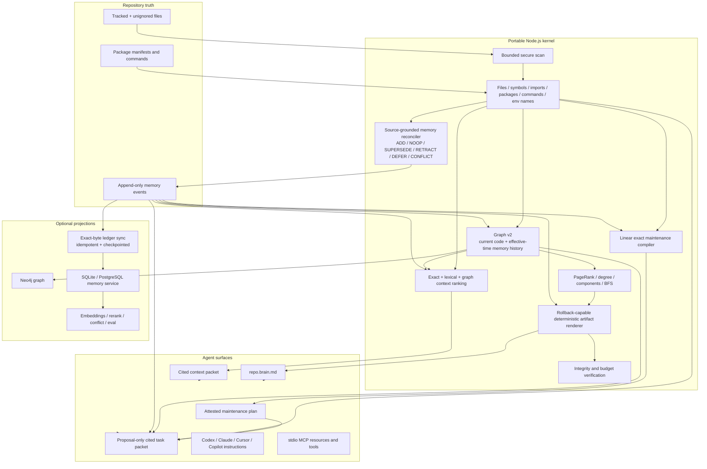

# Provena Repo Memory Architecture

This document defines the installable repository-memory product implemented by
`@provena/cli`. It complements the multi-service architecture in
[`ARCHITECTURE.md`](../ARCHITECTURE.md): the CLI is the zero-service local path;
the Python/Go/Rust services are optional shared and enterprise projections.

## Design goals

1. An agent should orient from a small bootloader, not a full-tree reread.
2. Repo facts must be reproducible from source and portable across clones.
3. Decisions, preferences, rationale, mistakes, and handoffs must survive code churn.
4. Every retrieved item must identify its file, symbol, line, or memory event.
5. The product must boot without a model, database server, Python, or cloud account.
6. Heavier retrieval, ML, and storage systems must be optional projections.
7. A failed refresh must not destroy the last good memory state.
8. Maintenance must remain deterministic, cited, bounded, and proposal-only.

## System boundary



## Artifact contract

The following files are intended to be committed:

| Artifact | Authority | Purpose |
|---|---|---|
| `.provena/config.json` | Versioned configuration | Repository UUID, scope, optional-store settings, scan globs |
| `.provena/repo.brain.md` | Derived | Compact first-read agent bootloader |
| `.provena/repo.map.json` | Derived | Repository identity, files, hashes, symbols, packages, commands, environment names |
| `.provena/graph.json` | Derived | Stable typed nodes and edges |
| `.provena/maintenance.plan.json` | Derived | Attested, bounded review proposals compiled from the current map and canonical active ledger heads |
| `.provena/manifest.json` | Derived | Source/memory fingerprints, hashes, byte counts |
| `.provena/schema/memory-event.schema.json` | Versioned contract | Machine-readable ledger schema |
| `.provena/memory/events.jsonl` | Canonical durable memory | Immutable memory events |
| `.provena/views/*.md` | Derived | Human/agent-readable decision, workflow, and learning views |
| `.provena/agent-instructions.md` | Managed | Shared agent boot protocol |

Derived outputs are written through temporary files and only rewritten when
bytes change. They contain no absolute checkout path or generated timestamp. A
clone using the same source bytes, ledger, configuration, and supported runtime
can regenerate the same files.

Machine-local runtime, cache, packets, logs, databases, PIDs, and stop signals
are selectively ignored. Durable files are explicitly re-included even when a
legacy whole-folder ignore exists; unknown `.provena/` contents are not exposed
automatically.

Bundling makes the portable runtime registry-independent but not tiny. The
current package dry run is about 10 MB compressed and 78 MB unpacked with 128
production packages; release candidates must record the actual npm pack JSON
because this footprint changes with the lockfile.

Outside `.provena/`, installation can add managed blocks or entries to agent
instruction files, project MCP configs, and eligible repo-local Git hooks.
Conflicting user-owned MCP entries and non-shell hooks are preserved and
reported rather than overwritten.

## Repository scan

The scanner prefers `git ls-files --cached --others --exclude-standard` so it
honors repository ignore policy. A bounded fallback handles non-Git folders.

Safety and performance constraints:

- no symlink traversal;
- explicit secret-path exclusion (secret-bearing `.env` files, private keys,
  credentials, and SSH/AWS paths) while named `.env.example`/template files may
  contribute variable names but never values;
- binary and generated-output exclusion;
- per-file byte caps and per-file symbol caps;
- stable POSIX repo-relative paths;
- content SHA-256 fingerprints;
- deterministic ordering;
- package/command detection from manifests rather than command execution.

`.provena/repo.map.json` persists `scan.complete` plus a bounded
`scan.warnings` list. Any cap, read/stat failure, or malformed Node package
manifest makes the observation incomplete; reconciliation may add facts it did
observe, but it defers every apparent removal until a complete scan or positive
file-absence check proves the deletion. An excluded source that still exists is
also deferred by that positive-evidence check.

Normal refresh turns those manifest observations into durable memory without a
second source read, network call, model, or database. Packages become observed
facts and declared command invocations become observed workflows. Stable
logical keys are separate from semantic fingerprints, so changes append a
successor while A-to-B-to-A histories and remove/re-add histories retain unique
event IDs. The scanned manifest hash remains a source attestation but unrelated
edits in the same manifest do not churn an unchanged candidate.

Retraction requires positive deletion evidence. A removed command is eligible
only when the same manifest still parsed as a current package; a removed
manifest is eligible only when its repo-safe path is absent. Capped, excluded,
unreadable, malformed Node package, or otherwise incomplete observations are
deferred. The current repo-map schema exposes dependency names and command invocations, not
dependency versions or script bodies, so Provena does not overclaim those
version-only or body-only changes in this slice.

Current symbol/import extraction covers JavaScript/TypeScript, Python, Go, and
Rust with conservative language patterns. The existing semantic TS/JS indexer
can still write deeper chunks to the optional governed-memory store through
`provena index --store`.

Refresh currently enumerates, reads, and hashes every eligible file within the
configured file/byte/depth limits. The compact artifacts prevent every agent
from repeating that scan; an incremental change journal is still roadmap.

## Memory event schema

Each JSONL line is an immutable snake_case record:

```json
{
  "schema_version": 1,
  "id": "memory:...",
  "kind": "decision",
  "subject_type": "architecture",
  "title": "Keep authorization at the gateway",
  "body": "Downstream services receive a verified principal.",
  "structured_data": { "rationale": "One auditable policy boundary." },
  "status": "active",
  "applies_to": ["gateway/auth.go"],
  "sources": [
    { "path": "gateway/auth.go", "start_line": 42, "end_line": 67 }
  ],
  "provenance": {
    "actor": "developer",
    "method": "explicit",
    "agent": "codex",
    "session_id": "optional",
    "command": "provena remember"
  },
  "authority": "human",
  "confidence": 1,
  "importance": 0.9,
  "sensitivity": "internal",
  "created_at": "2026-07-09T00:00:00.000Z",
  "updated_at": "2026-07-09T00:00:00.000Z",
  "supersedes": [],
  "tags": ["auth", "boundary"],
  "triggers": ["authentication", "gateway"]
}
```

Supported kinds are `fact`, `decision`, `workflow`, `mistake`, `preference`,
`handoff`, and `invariant`. Subject types cover repo, file, symbol, command,
test, API, architecture, and task.

Rules:

- decisions, preferences, and rationale require explicit provenance;
- source paths must be repository-relative;
- confidence and importance are bounded to `[0, 1]`;
- supersession appends a new event and never rewrites history;
- duplicate IDs, malformed records, bad timestamps, and invalid line spans fail closed;
- likely raw secrets and private keys are rejected by a best-effort detector on
  interactive CLI/MCP writes;
- the Git-tracked ledger accepts only public/internal events;
  confidential/restricted writes are rejected and belong in the governed store.

Provena-managed observations add an exact generator/version/logical-key/
candidate-fingerprint/predecessor contract. Only tool-authority, observed,
internal events with the complete reserved contract are eligible for automatic
reconciliation. Explicit events are byte-preserved; decisions, preferences,
and rationale are never generated; higher-authority successors block a tool
override; and malformed or ambiguous managed lineages stop before persistence.

## Graph model

Node types:

- repository
- directory
- file
- symbol
- package
- command
- dependency
- environment
- memory

Edge types:

- contains
- defines
- declares
- depends_on
- imports
- uses
- supersedes
- cites
- applies_to

Memory events use a separate `memory:` ID namespace, so an event ID cannot
overwrite a repository, file, symbol, or package node. Each event projects only
bounded indexing fields: identity, title, kind, subject, declared status,
authority, confidence, importance, sensitivity, and its effective interval.
Bodies, arbitrary structured data, and credentials remain outside graph bytes.

The temporal model is deliberately producer-effective rather than bi-temporal.
`validFrom` is the event's canonical `createdAt`; an active predecessor's
exclusive `validTo` is the earliest direct successor time; a declared
superseded or retracted event has an empty interval. Explicit
`--memory-as-of YYYY-MM-DDTHH:mm:ss.sssZ` queries select active heads from the
ledger prefix effective at that boundary while keeping code topology current.
Because the ledger does not yet attest ingestion time, a later backdated append
can revise an earlier effective view. Historical repo maps, recorded-time
queries, and bi-temporal claims are not implemented.

IDs derive from semantic identity rather than array position. The graph ships
with deterministic weighted PageRank, normalized in/out/total degree,
weakly-connected components, direction-aware neighborhoods, and shortest-path
BFS. These algorithms use native maps rather than a second graph abstraction.

Neo4j is a rebuildable projection. `provena graph sync neo4j` upserts graph-v2
nodes and constant-label parameterized relationships under a stable repository
ID. Every row carries a projection token derived from the adapter namespace,
projection version, source fingerprint, and exact ledger fingerprint; stale
cleanup uses that token. It creates a composite node constraint and path index.
Neo4j credentials are environment-only, and memory bodies/structured payloads
are not projected. The adapter has deterministic mock-driver coverage but no
live-server proof. Cross-repository federation and incremental CDC are not
implemented.

## Context ranking

`provena context` builds a packet from five candidate classes: files, symbols,
commands, environment-variable names, and active memory events.

An optional canonical `memoryAsOf` boundary induces the active memory graph at
that effective instant before graph scoring. Packets retain the fingerprint of
the complete raw ledger, render the chosen boundary, and explicitly label
repository topology as current so inactive history cannot distort ranking or
be mistaken for a historical code snapshot.

Ranking order is intentionally explainable:

1. exact requested paths;
2. exact symbols;
3. exact commands;
4. exact query identity;
5. lexical token overlap;
6. memory importance and confidence;
7. PageRank/degree priors;
8. bounded graph-neighborhood expansion.

The packet enforces item, character, and estimated-token budgets. Every item
has at least one file/line/symbol or memory-event citation. The default path is
deterministic and model-free; optional embedding/reranking services can provide
additional candidates but must preserve citations and the hard budget.

Exact active memory IDs can be requested with repeatable `--memory-id` options.
They receive the highest selection tier, seed bounded graph expansion, and still
obey effective-time, sensitivity, citation, item, character, and token rules.

## Deterministic maintenance proposals

Every normal refresh compiles `.provena/maintenance.plan.json` from the same
committed repo map and exact raw-ledger snapshot used by the graph and manifest.
The plan detects four review conditions only: an active memory with neither a
source nor scope, a source absent from a complete current map, a non-dot scope
absent from a complete current map, and two or more active memories with the
same normalized kind, subject type, title, body, and scope. When a scan is
incomplete, path-absence checks are deferred instead of producing stale-memory
advice.

The compiler is linear in active events plus their source/scope references. It
does not rescan files, compare every pair, call a model, use embeddings, access a
database, or make a network request. A plan contains at most 256 issues and 256
tasks; each record contains at most 32 sorted memory IDs and 32 normalized
repo-relative paths, and the canonical artifact is capped at 512 KiB. It stores
fixed planner text and identifiers rather than memory bodies, titles,
provenance, snippets, commands, environment values, or credentials.

The full canonical plan is manifest-attested. `provena maintain plan` and the
read-only `provena_maintenance_plan` MCP tool return a clearly labeled bounded
view, not a modified object that claims the plan fingerprint. `provena maintain
context <task-id>` and `provena_maintenance_context` compile a cited packet from
the task's exact eligible memories and paths. These surfaces never approve,
apply, supersede, retract, delete, or create memory and never spawn a subagent.
Only the CLI performs its one normal refresh before reading the plan; MCP reads
the already committed generation. The context subcommand writes only the
existing ignored `.provena/context/latest.md` or `latest.json` output.

## Automatic upkeep

`provena init` installs four complementary refresh mechanisms:

| Trigger | Behavior |
|---|---|
| Agent boot instruction | `provena session start` refreshes before emitting context |
| Git lifecycle | Safe managed blocks on post-checkout, post-commit, and post-merge |
| Fixed cadence | Ignored portable runtime refreshes every 15 minutes by default |
| Explicit | `provena refresh`, `index`, `checkpoint`, and mutating MCP tools |

All four paths call the same locked refresh implementation. It plans the full
memory batch in memory, preserves the existing raw ledger as an exact byte
prefix, and publishes the ledger, views, map, graph, brain, maintenance plan,
and manifest as one rollback-capable generation with the manifest last. Handled write failures
restore the previous bytes. A process crash between multi-file renames is
detectable from manifest hashes and repaired by the next refresh; strict
crash-atomic multi-file publication would require a later generation pointer.

The portable runtime is installed from a packed copy of the executing CLI with
its production dependency tree bundled and dependency lifecycle scripts
disabled. This makes it independent of the registry, npx cache, and original
package installation. A cooperative stop file shuts the
daemon down without risking termination of a reused OS PID.

Git-hook installation refuses global or out-of-repository hook paths. The
daemon and session boot remain available when hooks cannot be safely installed.

## MCP surface

Project configs point clients at the persisted runtime. They remain stdio by
default, and the server uses the official MCP TypeScript SDK without writing
human logs to protocol stdout.

Resources:

- `provena://repo/brain`
- `provena://repo/map`
- `provena://repo/graph`
- `provena://repo/manifest`
- `provena://repo/memories` (public/internal active events only)

Tools:

- `provena_context`
- `provena_refresh`
- `provena_remember`
- `provena_graph_neighbors`
- `provena_graph_path`
- `provena_maintenance_plan` (read-only bounded plan view)
- `provena_maintenance_context` (read-only cited task packet)

The surface therefore remains five resources and now has seven tools over both
stdio and loopback HTTP. Tools are scoped to the current repository. There is no delete or arbitrary
command-execution tool. MCP exposes only public/internal active memories;
confidential/restricted writes are rejected, as are likely credential-like
writes.

Local clients that cannot launch stdio can run
`provena mcp serve --http [--port <port>]`. The default MCP URL is
`http://127.0.0.1:18093/mcp`, with `GET /healthz` on the same origin. The
persisted `runtime.mjs` delegates this command to its installed CLI rather than
duplicating protocol code. The listener is foreground-only and closes on
Ctrl+C/SIGINT or SIGTERM.

HTTP uses a fresh stateless JSON-response server and transport per POST, a
100 KiB JSON limit, at most 16 messages in a JSON-RPC batch, fixed loopback
binding, and Host/Origin checks. It exposes no GET/SSE or DELETE/session flow
and writes no HTTP pid, token, session, or database state. It is deliberately
unauthenticated: any local process can call read and mutation tools while it
runs. TLS, auth, remote binding, permissive CORS, daemonization, managed-client
migration, rate limiting, and replacement of the authenticated enterprise
proxy are outside this local compatibility surface.

## Optional service integration

The local ledger is not a replacement for Provena's governed multi-tenant
store. It is the portable repo truth that feeds it through one explicit,
measured projection boundary:

```text
provena sync store [--json | --dry-run]
```

The command validates one in-memory snapshot of
`.provena/memory/events.jsonl`, then sends its exact UTF-8 text, byte count,
SHA-256 fingerprint, repository ID, and tenant/project scope to
`POST /v1/repositories/{repository_id}/memory-events/sync` at the configured
loopback URL. Authenticated connected deployments point that URL at the Go
gateway and provide the bearer key through the configured environment-variable
name; the gateway discards caller identity headers and rebuilds them from
verified key claims. Auth-disabled private loopback mode may address the store
directly. The store verifies
the raw hash before parsing, validates every event before writing, assigns a
stable repository-scoped memory ID, and preserves the complete canonical event
inside governed metadata. It projects sources, triggers, lifecycle state, and
new-to-old `supersedes` edges in one database transaction. The repository
checkpoint is the last write, so any failure rolls back the batch; an identical
replay is a measured no-op.

The bridge bypasses the intelligence write extractor because these records are
already canonical. The local manifest reconciler may append new canonical
observations during refresh, but it never splits or mutates an existing ledger
event.
An older branch snapshot never deletes or reactivates events already projected
from another branch. Ordinary refresh remains Node-only and network-free;
automatic daemon sync is intentionally a separate opt-in lifecycle feature.

| Mode | Dependencies | Use case |
|---|---|---|
| Repo brain | Node only | Individual repo, coding agents, clone-portable memory |
| Standalone store | Python + SQLite | CRUD, FTS5, sqlite-vec KNN when available or linear cosine fallback, audit, HTTP APIs |
| Production store | Python + PostgreSQL | Shared memory, `tsvector` FTS, and linear cosine fallback; pgvector KNN is roadmap |
| Polyglot | Go + Rust + Python + queue/cache | Gateway, policies, orchestration, backpressure |
| Neo4j projection | Neo4j | Cross-cutting graph exploration and analytics |

Database adapters are projections behind one event/provenance contract. A new
MongoDB or vector database adapter should not introduce a second memory schema;
it must demonstrate idempotent replay, supersession, tenant isolation, citation
preservation, deletion semantics, and conformance-harness coverage.

## Failure and consistency semantics

- Brain artifacts use temporary files plus rename and only update on changed bytes.
- `readRepoBrainArtifacts` holds the brain lock while it captures every managed
  artifact, deterministically reconstructs the expected bytes, and verifies
  manifest hashes and lengths. MCP serves that verified snapshot rather than
  reopening a path after validation.
- New events preserve the existing raw ledger as an exact byte prefix. Explicit
  writes append one validated record; refresh reconciliation validates its
  complete planned suffix before publishing it.
- Invalid ledger data stops derivation rather than silently dropping history.
- Changed semantic-index files keep their prior live store memories until the
  new parse/write/relation/entity pipeline succeeds.
- Successful replacement hard-deletes only obsolete generated IDs and cascades
  stale relations.
- Recreating an exact soft-deleted store memory is rejected by its tombstone;
  hard deletion is required before an equivalent new record can be created.
- The integrity harness checks deterministic replay, artifact hashes, graph
  references, maintenance-plan attestation, path portability, bootloader size,
  citation availability, and context budget compliance.

## Extension rules

Any new parser, storage adapter, retrieval model, or agent connector must:

1. leave the Node-only boot path functional;
2. avoid hardcoded model IDs and secret values;
3. emit repository-relative citations;
4. use stable identities and idempotent replay;
5. preserve the append-only event contract;
6. expose a removal/rebuild path;
7. pass packed-consumer and harness verification.

## Rehydration and removal

The committed artifacts are clone-portable, while the runtime, daemon, MCP
client state, and hooks are machine-local. Run `provena init` after cloning or
upgrading to recreate those managed integrations and refresh the projections.
The portable path defaults to stdio MCP and opens no port. Explicit
`provena mcp serve --http` opens the foreground loopback endpoint at
`127.0.0.1:18093`; the separate optional Python store launched through the CLI
defaults to `127.0.0.1:18092`.

Automated `upgrade` and `uninstall` commands are roadmap. Removal currently
requires stopping the daemon, removing Provena-managed instruction/config/hook
blocks, uninstalling the package, and preserving or exporting the ledger before
deleting `.provena/`.

## Explicitly unimplemented surfaces

The current milestone does not include transaction-time/bi-temporal history,
historical repository maps, incremental filesystem or Neo4j CDC,
cross-repository retrieval, a MongoDB adapter, learned local ranking, semantic
consolidation or decay, automatic memory approval/application, an enterprise
connector worker fleet, a hosted admin UI, autonomous subagent DAG scheduling
or execution, or task-outcome-driven model training. These remain separate
roadmap work with their own security, evaluation, and operational gates.
