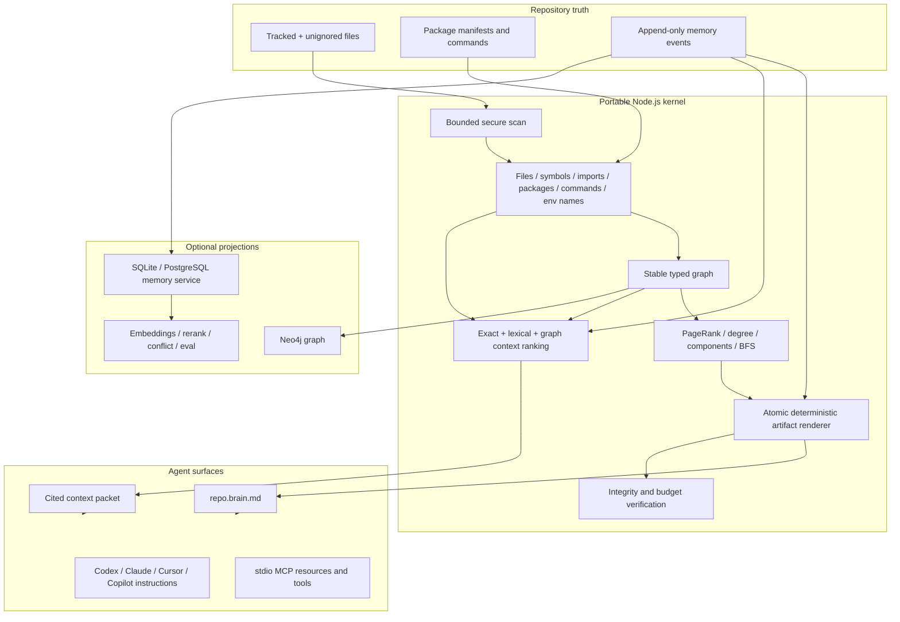

# Provena Repo Memory Architecture

This document defines the installable repository-memory product implemented by
`@provena/cli`. It complements the multi-service architecture in
[`ARCHITECTURE.md`](../ARCHITECTURE.md): the CLI is the zero-service local path;
the Python/Go/Rust services are optional shared and enterprise projections.

## Design goals

1. An agent should orient from a small bootloader, not a full-tree reread.
2. Repo facts must be reproducible from source and portable across clones.
3. Decisions, preferences, rationale, mistakes, and handoffs must survive code churn.
4. Every retrieved item must identify its file, symbol, line, or memory event.
5. The product must boot without a model, database server, Python, or cloud account.
6. Heavier retrieval, ML, and storage systems must be optional projections.
7. A failed refresh must not destroy the last good memory state.

## System boundary



## Artifact contract

The following files are intended to be committed:

| Artifact | Authority | Purpose |
|---|---|---|
| `.provena/config.json` | Versioned configuration | Repository UUID, scope, optional-store settings, scan globs |
| `.provena/repo.brain.md` | Derived | Compact first-read agent bootloader |
| `.provena/repo.map.json` | Derived | Repository identity, files, hashes, symbols, packages, commands, environment names |
| `.provena/graph.json` | Derived | Stable typed nodes and edges |
| `.provena/manifest.json` | Derived | Source/memory fingerprints, hashes, byte counts |
| `.provena/schema/memory-event.schema.json` | Versioned contract | Machine-readable ledger schema |
| `.provena/memory/events.jsonl` | Canonical durable memory | Immutable memory events |
| `.provena/views/*.md` | Derived | Human/agent-readable decision, workflow, and learning views |
| `.provena/agent-instructions.md` | Managed | Shared agent boot protocol |

Derived outputs are written through temporary files and only rewritten when
bytes change. They contain no absolute checkout path or generated timestamp. A
clone using the same source bytes, ledger, configuration, and supported runtime
can regenerate the same files.

Machine-local runtime, cache, packets, logs, databases, PIDs, and stop signals
are selectively ignored. Durable files are explicitly re-included even when a
legacy whole-folder ignore exists; unknown `.provena/` contents are not exposed
automatically.

Bundling makes the portable runtime registry-independent but not tiny. The
current package dry run is about 10 MB compressed and 78 MB unpacked with 127
production packages; release candidates must record the actual npm pack JSON
because this footprint changes with the lockfile.

Outside `.provena/`, installation can add managed blocks or entries to agent
instruction files, project MCP configs, and eligible repo-local Git hooks.
Conflicting user-owned MCP entries and non-shell hooks are preserved and
reported rather than overwritten.

## Repository scan

The scanner prefers `git ls-files --cached --others --exclude-standard` so it
honors repository ignore policy. A bounded fallback handles non-Git folders.

Safety and performance constraints:

- no symlink traversal;
- explicit secret-path exclusion (secret-bearing `.env` files, private keys,
  credentials, and SSH/AWS paths) while named `.env.example`/template files may
  contribute variable names but never values;
- binary and generated-output exclusion;
- per-file byte caps and per-file symbol caps;
- stable POSIX repo-relative paths;
- content SHA-256 fingerprints;
- deterministic ordering;
- package/command detection from manifests rather than command execution.

Current symbol/import extraction covers JavaScript/TypeScript, Python, Go, and
Rust with conservative language patterns. The existing semantic TS/JS indexer
can still write deeper chunks to the optional governed-memory store through
`provena index --store`.

Refresh currently enumerates, reads, and hashes every eligible file within the
configured file/byte/depth limits. The compact artifacts prevent every agent
from repeating that scan; an incremental change journal is still roadmap.

## Memory event schema

Each JSONL line is an immutable snake_case record:

```json
{
  "schema_version": 1,
  "id": "memory:...",
  "kind": "decision",
  "subject_type": "architecture",
  "title": "Keep authorization at the gateway",
  "body": "Downstream services receive a verified principal.",
  "structured_data": { "rationale": "One auditable policy boundary." },
  "status": "active",
  "applies_to": ["gateway/auth.go"],
  "sources": [
    { "path": "gateway/auth.go", "start_line": 42, "end_line": 67 }
  ],
  "provenance": {
    "actor": "developer",
    "method": "explicit",
    "agent": "codex",
    "session_id": "optional",
    "command": "provena remember"
  },
  "authority": "human",
  "confidence": 1,
  "importance": 0.9,
  "sensitivity": "internal",
  "created_at": "2026-07-09T00:00:00.000Z",
  "updated_at": "2026-07-09T00:00:00.000Z",
  "supersedes": [],
  "tags": ["auth", "boundary"],
  "triggers": ["authentication", "gateway"]
}
```

Supported kinds are `fact`, `decision`, `workflow`, `mistake`, `preference`,
`handoff`, and `invariant`. Subject types cover repo, file, symbol, command,
test, API, architecture, and task.

Rules:

- decisions, preferences, and rationale require explicit provenance;
- source paths must be repository-relative;
- confidence and importance are bounded to `[0, 1]`;
- supersession appends a new event and never rewrites history;
- duplicate IDs, malformed records, bad timestamps, and invalid line spans fail closed;
- likely raw secrets and private keys are rejected by a best-effort detector on
  interactive CLI/MCP writes;
- the Git-tracked ledger accepts only public/internal events;
  confidential/restricted writes are rejected and belong in the governed store.

## Graph model

Node types:

- repository
- directory
- file
- symbol
- package
- command
- dependency
- environment

Edge types:

- contains
- defines
- declares
- depends_on
- imports
- uses

IDs derive from semantic identity rather than array position. The graph ships
with deterministic weighted PageRank, normalized in/out/total degree,
weakly-connected components, direction-aware neighborhoods, and shortest-path
BFS. These algorithms use native maps rather than a second graph abstraction.

Neo4j is a rebuildable projection. `provena graph sync neo4j` upserts nodes and
relations under a stable repository ID, marks the source fingerprint, and
transactionally removes stale projected entities. It creates a composite node
constraint and path index. Neo4j credentials are environment-only. The current
projection represents the latest code topology; temporal event/memory history,
cross-repository graph federation, and incremental CDC are not implemented.

## Context ranking

`provena context` builds a packet from five candidate classes: files, symbols,
commands, environment-variable names, and active memory events.

Ranking order is intentionally explainable:

1. exact requested paths;
2. exact symbols;
3. exact commands;
4. exact query identity;
5. lexical token overlap;
6. memory importance and confidence;
7. PageRank/degree priors;
8. bounded graph-neighborhood expansion.

The packet enforces item, character, and estimated-token budgets. Every item
has at least one file/line/symbol or memory-event citation. The default path is
deterministic and model-free; optional embedding/reranking services can provide
additional candidates but must preserve citations and the hard budget.

## Automatic upkeep

`provena init` installs four complementary refresh mechanisms:

| Trigger | Behavior |
|---|---|
| Agent boot instruction | `provena session start` refreshes before emitting context |
| Git lifecycle | Safe managed blocks on post-checkout, post-commit, and post-merge |
| Fixed cadence | Ignored portable runtime refreshes every 15 minutes by default |
| Explicit | `provena refresh`, `index`, `checkpoint`, and mutating MCP tools |

The portable runtime is installed from a packed copy of the executing CLI with
its production dependency tree bundled and dependency lifecycle scripts
disabled. This makes it independent of the registry, npx cache, and original
package installation. A cooperative stop file shuts the
daemon down without risking termination of a reused OS PID.

Git-hook installation refuses global or out-of-repository hook paths. The
daemon and session boot remain available when hooks cannot be safely installed.

## MCP surface

Project configs point clients at the persisted runtime. The server uses the
official MCP TypeScript SDK over stdio and writes no human logs to stdout.

Resources:

- `provena://repo/brain`
- `provena://repo/map`
- `provena://repo/graph`
- `provena://repo/manifest`
- `provena://repo/memories` (public/internal active events only)

Tools:

- `provena_context`
- `provena_refresh`
- `provena_remember`
- `provena_graph_neighbors`
- `provena_graph_path`

Tools are scoped to the current repository. There is no delete or arbitrary
command-execution tool. MCP exposes only public/internal active memories;
confidential/restricted writes are rejected, as are likely credential-like
writes.

## Optional service integration

The local ledger is not a replacement for Provena's governed multi-tenant
store. It is the portable repo truth that can feed it.

| Mode | Dependencies | Use case |
|---|---|---|
| Repo brain | Node only | Individual repo, coding agents, clone-portable memory |
| Standalone store | Python + SQLite | CRUD, FTS5, sqlite-vec KNN when available or linear cosine fallback, audit, HTTP APIs |
| Production store | Python + PostgreSQL | Shared memory, `tsvector` FTS, and linear cosine fallback; pgvector KNN is roadmap |
| Polyglot | Go + Rust + Python + queue/cache | Gateway, policies, orchestration, backpressure |
| Neo4j projection | Neo4j | Cross-cutting graph exploration and analytics |

Database adapters are projections behind one event/provenance contract. A new
MongoDB or vector database adapter should not introduce a second memory schema;
it must demonstrate idempotent replay, supersession, tenant isolation, citation
preservation, deletion semantics, and conformance-harness coverage.

## Failure and consistency semantics

- Brain artifacts use temporary files plus rename and only update on changed bytes.
- The event ledger appends one synced canonical record at a time.
- Invalid ledger data stops derivation rather than silently dropping history.
- Changed semantic-index files keep their prior live store memories until the
  new parse/write/relation/entity pipeline succeeds.
- Successful replacement hard-deletes only obsolete generated IDs and cascades
  stale relations.
- Recreating an exact soft-deleted store memory is rejected by its tombstone;
  hard deletion is required before an equivalent new record can be created.
- The integrity harness checks deterministic replay, artifact hashes, graph
  references, path portability, bootloader size, citation availability, and
  context budget compliance.

## Extension rules

Any new parser, storage adapter, retrieval model, or agent connector must:

1. leave the Node-only boot path functional;
2. avoid hardcoded model IDs and secret values;
3. emit repository-relative citations;
4. use stable identities and idempotent replay;
5. preserve the append-only event contract;
6. expose a removal/rebuild path;
7. pass packed-consumer and harness verification.

## Rehydration and removal

The committed artifacts are clone-portable, while the runtime, daemon, MCP
client state, and hooks are machine-local. Run `provena init` after cloning or
upgrading to recreate those managed integrations and refresh the projections.
The portable path uses stdio MCP and opens no network port; the optional Python
store launched through the CLI defaults to `127.0.0.1:18092`.

Automated `upgrade` and `uninstall` commands are roadmap. Removal currently
requires stopping the daemon, removing Provena-managed instruction/config/hook
blocks, uninstalling the package, and preserving or exporting the ledger before
deleting `.provena/`.

## Explicitly unimplemented surfaces

The current milestone does not include temporal graph history, incremental
filesystem CDC, cross-repository retrieval, a MongoDB adapter, learned local
ranking, an enterprise connector worker fleet, a hosted admin UI, autonomous
subagent DAG scheduling, or task-outcome-driven model training. These remain
separate roadmap work with their own security, evaluation, and operational
gates.
